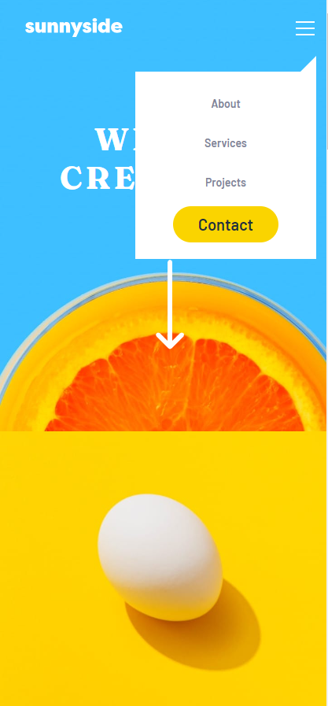

# Frontend Mentor - Sunnyside agency landing page solution

## Table of contents

- [Overview](#overview)
  - [The challenge](#the-challenge)
  - [Screenshot](#screenshot)
  - [Links](#links)
- [My process](#my-process)
  - [Built with](#built-with)
- [Author](#author)

## Overview

### The challenge

Users should be able to:

- View the optimal layout for the site depending on their device's screen size
- See hover states for all interactive elements on the page

### Screenshot

- Solution URL: [Solution URL here](https://www.frontendmentor.io/solutions/sunnyside-agency-landing-page-9LBSDJ8xTa)
- Live Site URL: [Live site URL here](https://unaygney.github.io/landingPagee/)

## My process

### Built with

- Semantic HTML5 markup
- CSS custom properties
- Flexbox
- CSS Grid
- Mobile-first workflow
- SASS

## Author

- Website - [Add your name here](https://www.guneyunay.com)
- Frontend Mentor - [@unaygney](https://www.frontendmentor.io/profile/unaygney)

